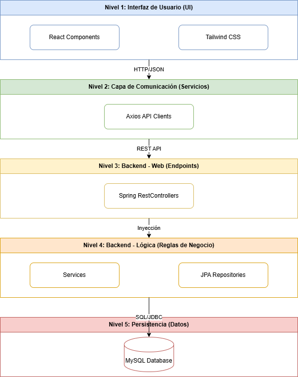
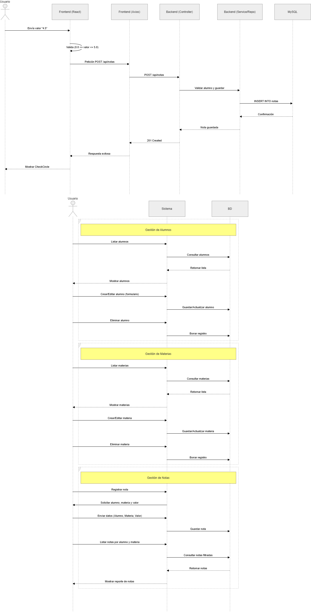

# Sistema de Gestión Académica - Prueba Técnica

Este proyecto es una solución Full Stack para la gestión de alumnos, materias y calificaciones.

## Arquitectura de Software
Para este desarrollo se aplicó una arquitectura por capas, permitiendo una separación clara entre la lógica de negocio, el acceso a datos y la interfaz de usuario.

- **Frontend:** React + TypeScript + Tailwind CSS v3.
- **Backend:** Spring Boot (Java) + JPA/Hibernate.
- **Base de Datos:** MySQL.

### Diagrama de Arquitectura


### Diagrama de Secuencia (Flujo de Registro)
Este diagrama ilustra el proceso desde que el usuario ingresa una nota hasta su persistencia en la base de datos, incluyendo las validaciones de rango (0.0 - 5.0)


## Tecnologías y Herramientas
- **Docker & Docker Compose:** Para la orquestación de contenedores.
- **Lucide React:** Para la iconografía.
- **Axios:** Para el consumo de APIs.

### Instrucciones de Ejecución
1. Clonar el repositorio.
2. En la raíz del proyecto, ejecutar:
   ```bash
   docker compose up --build
3. Acceder al Frontend en: http://localhost:3000

4. Acceder a la API en: http://localhost:8080/api
